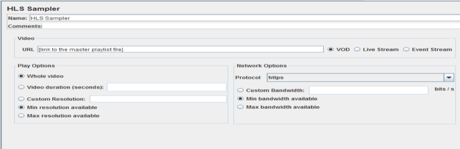
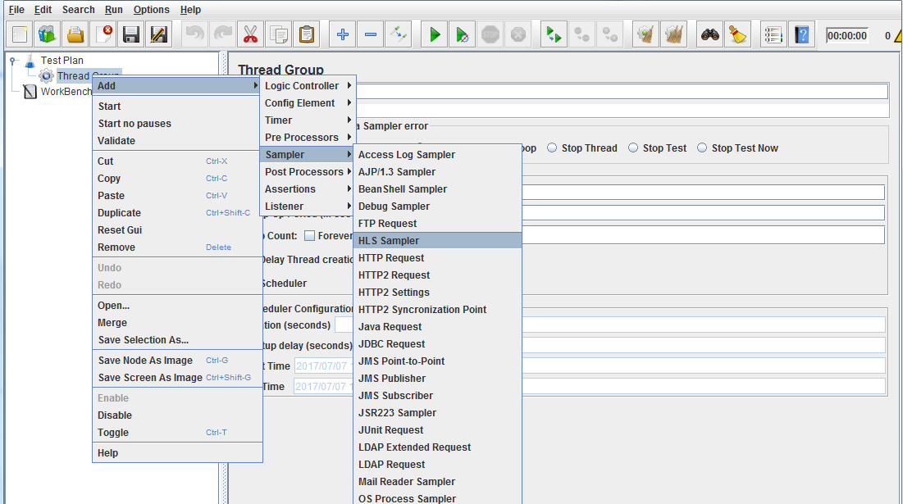
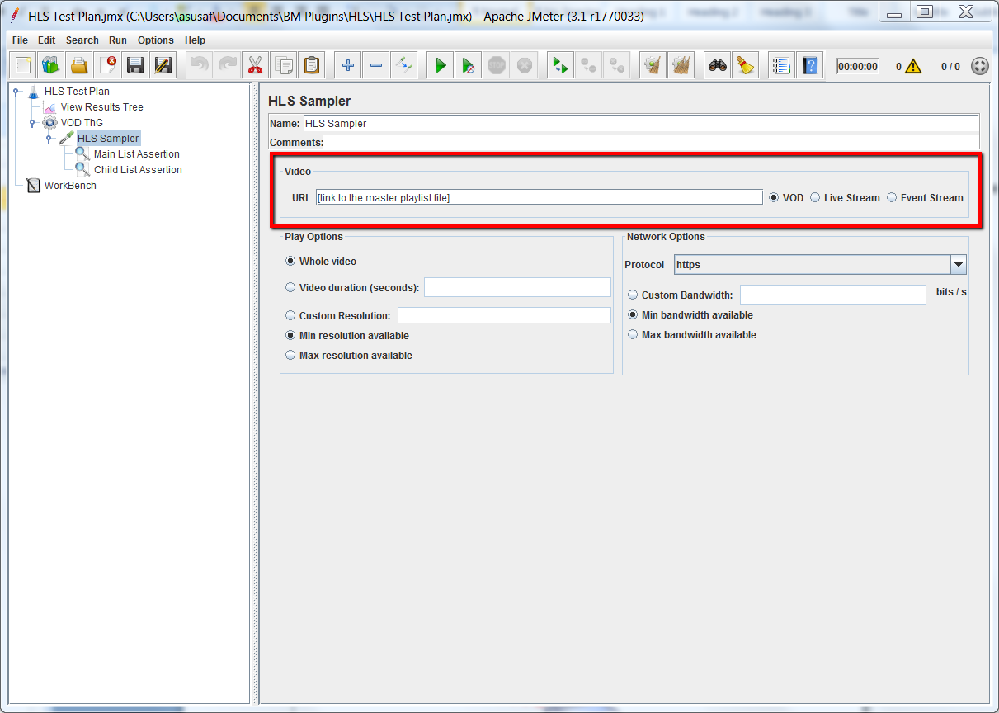
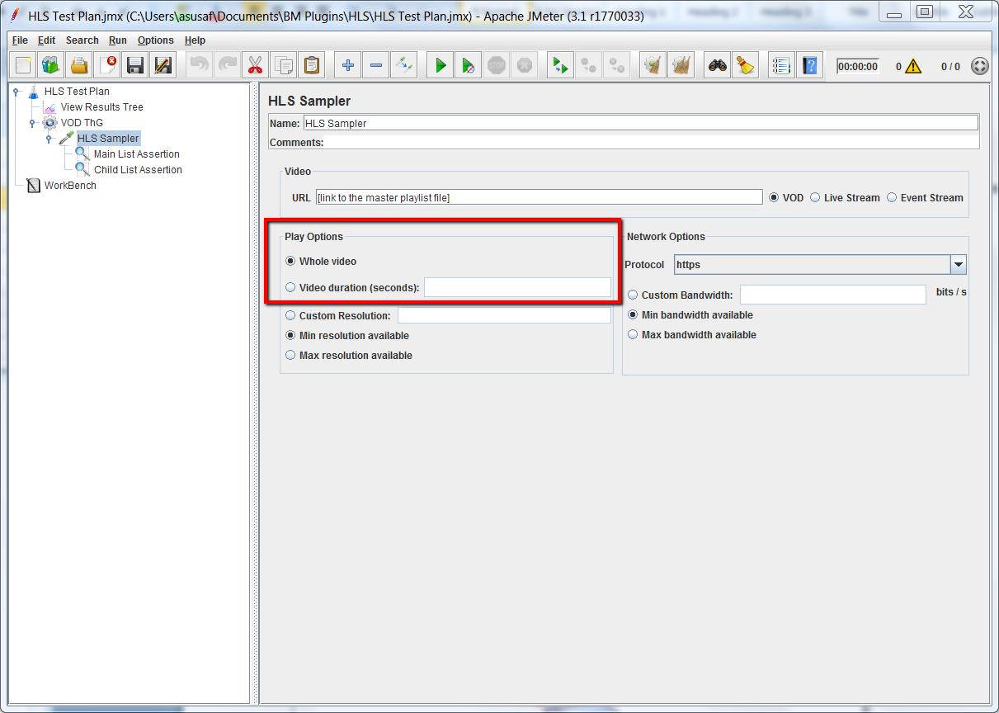
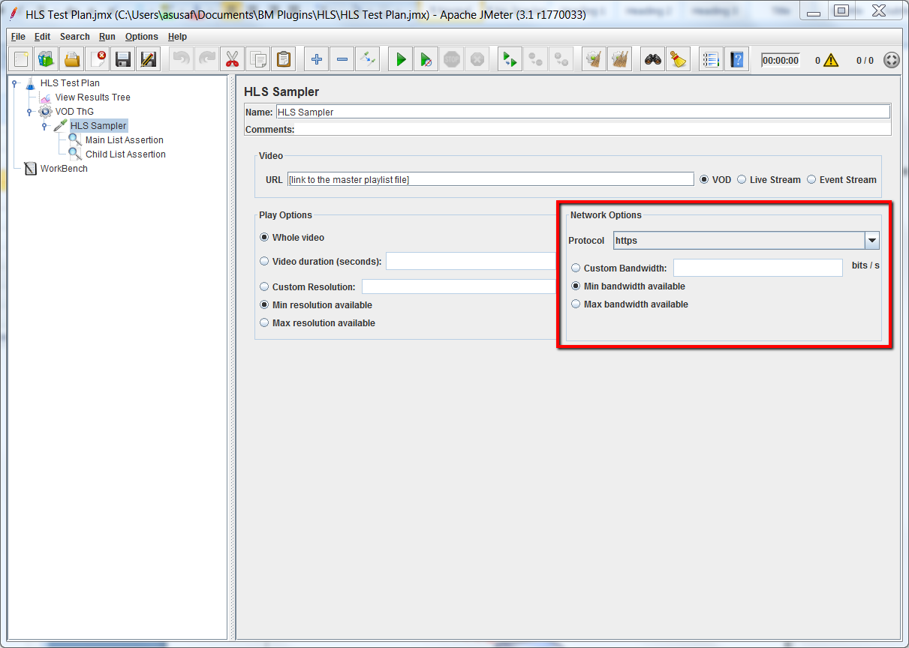
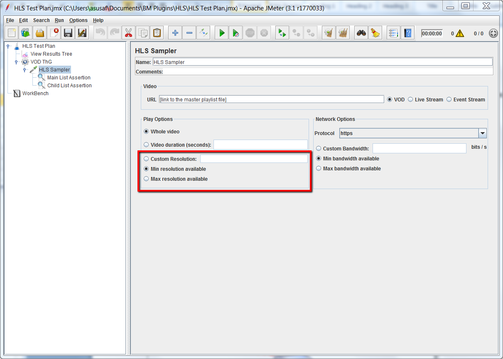
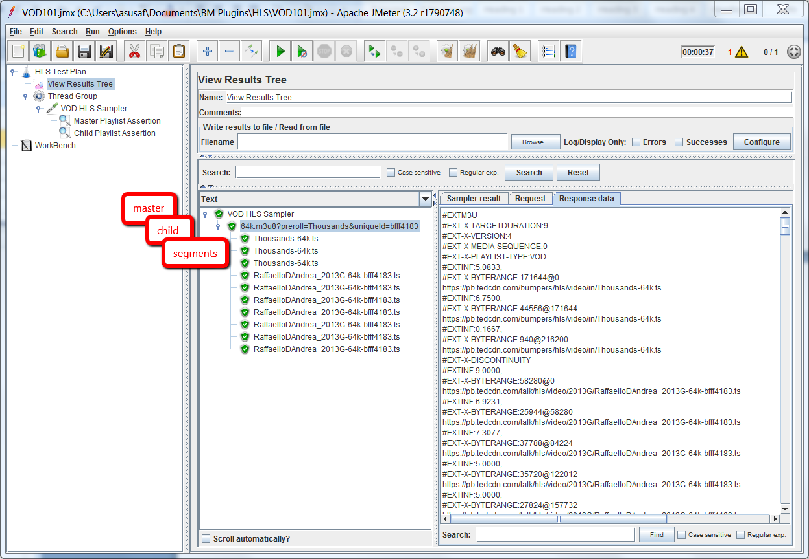

# HLS PLUGIN
The HLS protocol provides a reliable, cost-effective means of delivering continuous and long-form video over the Internet. It allows a receiver to adapt the bitrate of the media to the current network conditions, in order to maintain uninterrupted playback at the best possible quality.
 #### In a HTTP Live Streaming process:
- The audio/video to be streamed is reproduced by a media encoder at different quality levels, bitrates and resolutions. Each version is called a variant.
- The different variants are split up into smaller Media Segment Files.
- The encoder creates a Media Playlist for each variant with the URLs of each Media Segment.
- The encoder creates a Master Playlist File with the URLs of each Media Playlist.
To play, the client first downloads the Master Playlist, and then the Media Playlists. Then, they play each Media Segment declared within the chosen Media Playlist. The client can reload the Playlist to discover any added segments. This is needed in cases of live events, for example.
## How the plugin works
### Concept
This plugin solves the HLS complexity internally. It gets the master playlist file, chooses one variant and gets its media playlist file, the segments, etc. The plugin simulates users consuming media over HLS supporting different situations: stream type, playback time, network bandwidth and device resolution.

Here is what the HLS Sampler looks like:

### To create your test
- Install the HLS plugin from the Plugins Manager
- Create a Thread Group.
- Add the HLS Sampler Add -> Sampler -> HLS Sampler

After that you can add assertions, listeners, etc.
### HLS Sampler Properties
The following properties can be set in the HLS Sampler. They should be tuned to simulate the real scenario you want to test.
#### Video options
Set the link to the master playlist file
- URL

Set the video type corresponding to the playlist
- VOD
- Live Stream
- Event Stream

#### Play options
Set the playback time of the test:
- Whole video
- Video duration (seconds)

#### Network options
Select the protocol of the playlist you want to test. You can identify it in the link to the master playlist file:
- http
- https
#### Bandwidth
Select the bandwidth you want to simulate in your test. If there is only one playlist for the selected bandwidth, the plugin will select the playlist based only on this criterion.
- Custom Bandwidth (bits/s)
- Min bandwidth available
- Max bandwidth available

#### Resolution
After selecting the desired bandwidth you can select a resolution to simulate your specific device.

## Results
You can set listeners to evaluate the results of your tests. The View Results Tree Listener displays the HLS Hierarchy, so you can inspect how the requests and responses worked.

Assertions are supported for the master playlist and variant (child) playlist. Examples: Response Assertion and Duration Assertion. Select “Main sample only” in assertion to test the master playlist response and “Sub-samples only” to test the variant (child) playlist response.
