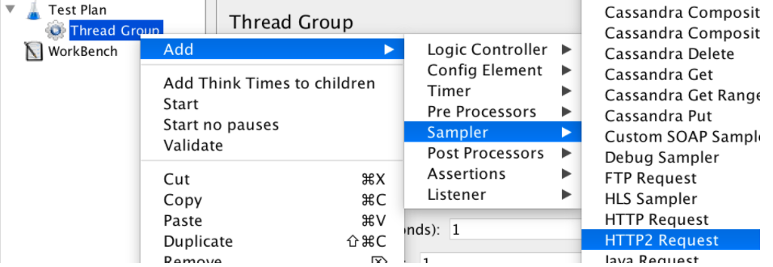
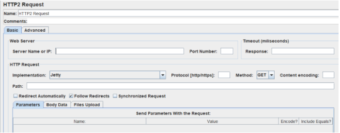
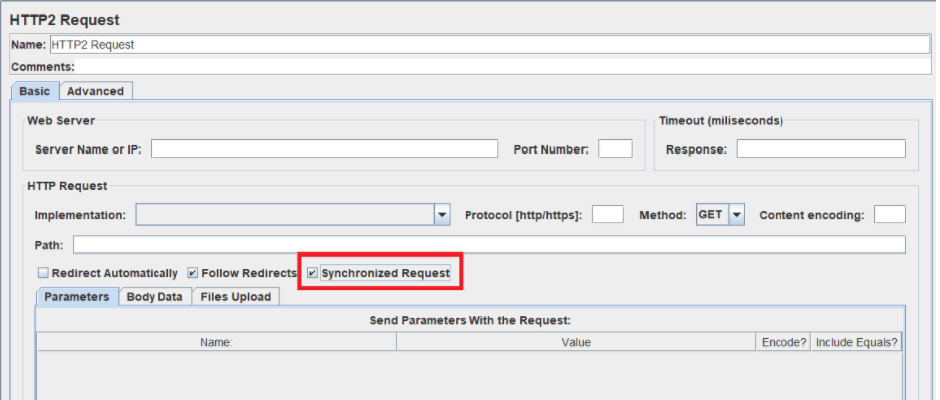
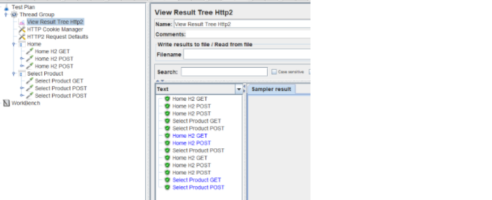

# HTTP2 Plugin for JMeter

## HTTP2 Sampler for JMeter 

### Step to use HTTP2 Sampler

1- Download alpn-boot according to your JVM version
		https://www.eclipse.org/jetty/documentation/9.4.x/alpn-chapter.html
	
2- On Windows at the start of jmeter.bat add the next line:
		set JVM_ARGS= -Xbootclasspath/p:<path.to.jar>;

   On Linux and Mac at the start of jmeter.sh add the next line:
		JVM_ARGS="-Xbootclasspath/p:<path.to.jar>"	

3- Restart JMeter

### To create your test:

1 - Create a Thread Group.
2 - Add the HTTP Sampler Add->Sampler->HTTP2 Sampler

3 - After that you can add timers, assertions, listeners, etc.

### Configuring the HTTP2 Sampler

Let’s explain the HTTP2 Sampler fields:

**Name** - Add a descriptive name for this HTTP/2 sampler to be shown in the tree.

**Server Name or IP** -   The domain name or IP address of the web server, e.g. www.sprint.com. [Do not include the http:// prefix.]

**Port Number** - The port the web server is listening to. Default: 443

**Response** - The number of milliseconds to wait for a response. Note that in this sampler we don’t include the field for the connection timeout since HTTP/2 has an automatic initial connection setting, and all samplers use this same connection. This is one of the cool features of HTTP/2. 

**Implementation** - Choose Jetty or Java. The default implementation is Jetty since it is the only one implemented at the moment. The Java implementation will be added in future release. 

**Protocol** - Choose   HTTP or HTTPS. Default: HTTPS

**Method** -  GET and POST are the ones supported at the moment.

**Content Encoding** - The content encoding to be used (for POST). This is the character encoding to be used, and is not related to the Content-Encoding HTTP header.

**Path** - The path to resource (For example: /servlets/myServlet)

**Redirect Automatically** - Sets the underlying HTTP protocol handler to automatically follow redirects, so they are not seen by JMeter, and therefore will not appear as samples. 

**Follow Redirects** -  If set, the JMeter sampler will check if the response is a redirect and will follow it. The initial redirect and further responses will appear as additional samples.

**Synchronized Request** - If set, JMeter will wait until receiving the response before sending more requests.
Send Parameters With the Request - All the fields are equivalent to HTTP/1.1 fields.

### Limitations

HTTP/2 is an asynchronous protocol, meaning we don’t have to wait for the response of the server to continue the communication. But the JMeter model executes synchronously. Therefore, if we want to add assertions or post processors to our HTTP/2 Requests, i. e. process the response, we need to select the checkbox Synchronized Request to indicate that JMeter needs to wait until receiving the response before sending more requests.

### View Result Tree Http2

The View Results Tree Listener isn’t fit for HTTP/2, which can send more than one request at the same time without waiting for a response. Using the regular listener means we won’t be able to see the responses of all asynchronous requests.
To solve this problem, you can use the View Result Tree Http2. This specialized listener provides a way to visualize a request that has not received a response yet. These requests will be written in blue, as you can see in the image below. When the response is received, the writing will turn immediately to black, and you will be able to see the response message. 

