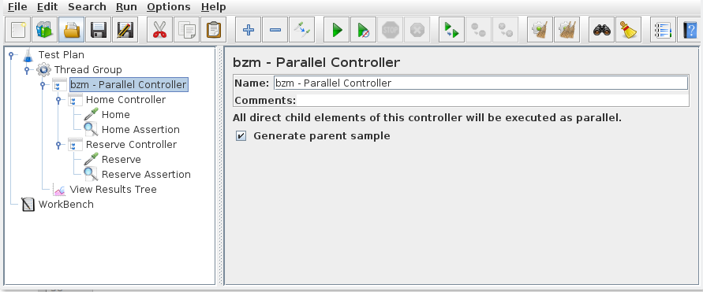

# Parallel Sampling for JMeter

## Parallel Controller 

Parallel Controller is a Controller that allows execute child elements parallel. 
Can be used to simulate a load using AJAX, download resources and many other different variants.

Use option _Generate parent sample_ to generate one parent sample that unite all child elements

[Download Example Test Plan](ParallelController.jmx)

## Parallel Sampler
 
Parallel Sampler allows make requests like embedded resources for URLs from list in GUI, without making request for main page. 

Click `Add Row` for added new row in URL list and then enter the URL into row.

[Download Example Test Plan](ParallelSampler.jmx)

## Roadmap

- test, test, test
- How to optimize resource usage and not spawn threads all the time?
- transaction samplers work or not?
