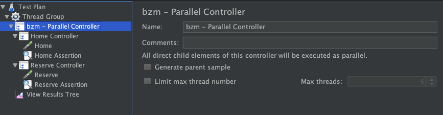

# Parallel Sampling for JMeter

## Parallel Controller 

Parallel Controller is a Controller that allows execute child elements parallel. 
Can be used to simulate a load using AJAX, download resources and many other different variants.

Use option _Generate parent sample_ to generate one parent sample that unite all child elements

### Limitations

Parallel Controller does **not** support work with **Transaction Controller** so if used you can get an unexpected results.
If you decide to use these controllers together familiarize yourself with already known problems that described in [roadmap](#roadmap)

[Download Example Test Plan](ParallelController.jmx)

## Parallel Sampler
 
Parallel Sampler allows make requests like embedded resources for URLs from list in GUI, without making request for main page. 

Click `Add Row` for added new row in URL list and then enter the URL into row.

[Download Example Test Plan](ParallelSampler.jmx)

## Roadmap

* test, test, test
* Known issues with Transaction Controller:
    * If Transaction Controller put in Parallel Controller and option `Generate parent sample` is enabled in two controllers 
    than you'll see parent sample of Transaction Controller and sub-sampler of this parent in parent sample of Parallel Controller ([fix]())
    * If Transaction Controller put in Parallel Controller and option `Generate parent sample` is enabled in Parallel Controller and disable in Transaction Controller 
    than you'll not see the result sample of transaction (_with number of samples and fails in transaction_) in parent sample of Parallel Controller
    * If Parallel Controller put in Transaction Controller and option `Generate parent sample` is disable in Parallel Controller and enabled in Transaction Controller 
    than you'll see that samples from Parallel Controller will have the same nesting as parent sample of Transaction Controller, and parent sample will be empty
