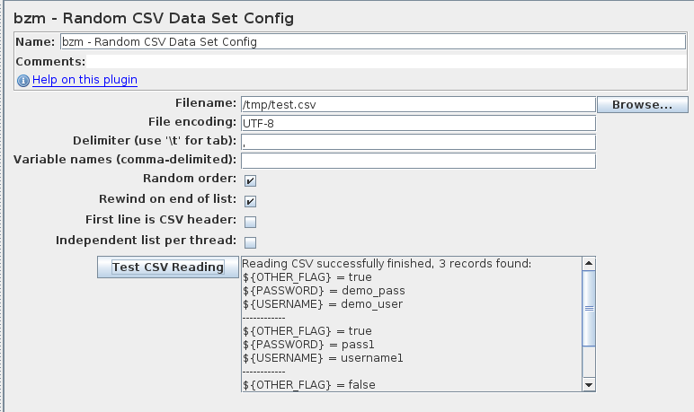

# Random CSV Data Set Config 

Random CSV Data Set Config is used to read CSV rows from file, split and put them into JMeter variables in random order.

This plugin has following options that affect the behavior:
  * `Filename` - path to CSV file. Relative path are resolved with respect to the path of the active test plan. For distributed testing, the CSV file must be stored on the server host system in the correct relative directory to where the JMeter server is started.;
  * `File encoding` - encoding of this CSV file;
  * `Delimiter` - delimiter that be used to split records in the file;
  * `Variable Names` - list (comma-separated) of variable names;
  * `Random order`  - The plugin will get records from the file in random order. This is the part that provides this element’s added value. If you don’t select this option, the element will work like the regular CSV Data Set Config.;
  * `Rewind on end of list` - if the flag is selected and an iteration loop has reached the end, the new loop will be started;
  * `First line is CSV header` - select this flag to skip header(used only if `Variable Names` is not empty);
  * `Independent list per thread` - When this is checked with “Random order”, each thread runs its own copy of CSV values with random order. When unchecked, all of threads go over the same randomized list of values.

_***At the beginning of the test, the config reads file. There are a delay and a large memory consumption for large files.***_

_In preview area shows only 20 records from CSV file._

