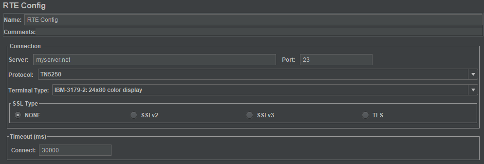
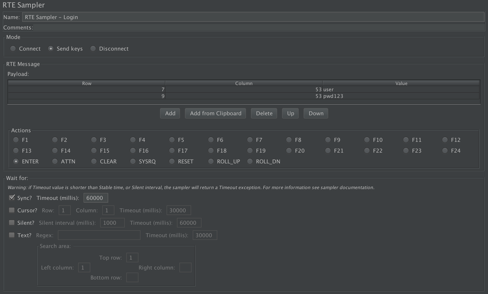
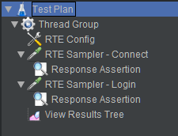
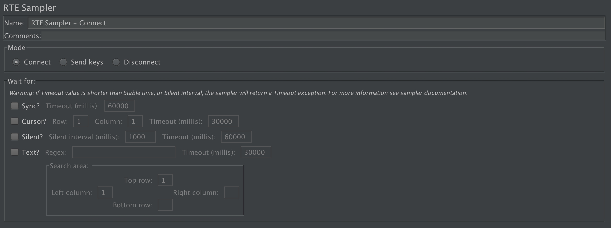

# JMeter-RTE-plugin

This project implements a JMeter plugin to **support RTE (Remote Terminal Emulation) protocols** by providing config elements and samplers.

Nowadays the plugin supports **IBM protocol's TN5250 and TN3270** by using embedded [xtn5250](https://sourceforge.net/projects/xtn5250/) and [dm3270](http://dmolony.github.io/) emulators with modifications to better accommodate to the plugin usage (exception handling, logging, external dependencies, etc).

People who usually work with these IBM servers interact with them, basically, by sending keystrokes from the terminal keyboard (or emulator) to fill forms or call processes.
In such regard, the sampler is designed in a way that the user can specify the position of fields on the screen and the text to set on them. Besides, the sampler allows to simulate the existing action buttons on the terminal keyboard like ENTER, F1, F2, F3..., ATTN, CLEAR, etc.    

## Usage

### Using the plugin

The plugin adds two different elements to JMeter:

A Config Element (RTE Config)

and a Sampler (RTE Sampler)

The RTE Config element sets the parameters to be used by the sampler in order to establish a connection to the server. These parameters are:

- *Server* (required). The url or ip of the IBM server.
- *Port*. The port number to connect, default value is 23.
- *Protocol* (required). The protocol to use in the communication. If the server is an AS400 or iSeries it typically uses TN5250, on the other hand, if it's a mainframe system it uses TN3270.
- *Terminal Type*. The terminal type to emulate from the client. If the server does not supports the chosen one, it will use the default value for the protocol.
- *SSL Type*. The SSL protocol to use if it's required by the server. The keystore file and the keystore password should be specified in *system.properties* file by adding the lines `javax.net.ssl.keyStore=</keystore_path/file.keystore>` and `javax.net.ssl.keyStorePassword=<changeit>`. 
- *Timeout*. The maximum time to wait to establish the connection by the sampler. This time takes into account the time until the client receives a response screen from the server. 

Connections are shared by RTE Samplers in same thread created by a thread group (different threads use separate connections). The RTE Sampler element checks if a connection exists to send the packets, if none exists, it uses the RTE Config data to establish a new one. Connections are automatically closed (unless Jmeter property `RTEConnectionConfig.reuseConnections=true` is specified in *jmeter.properties*) at the end of each thread iteration. 

This means that it's **always required an RTE Config Element** in order to connect the RTE samplers to a server.

If more than one RTE Config element is used at the same level of the Test Plan, JMeter will take the value of the first one. On the other hand, if there are more than one RTE Config used but in different levels, JMeter will use the "closest" (according to test plan tree levels) Config element for each sampler.

The RTE Sampler fields are:
- *Mode*. Specifies how the sampler will operate among 3 options:
  - *Connect*. When this option is selected the sampler will just connect to the terminal server, wait for specified conditions, and output the welcome screen. If a connection is already established to the server, then the sampler will not affect current connection, will wait for specified conditions, and return current emulator screen. This mode is useful to validate for welcome screens or just wait for some condition. 
    > It is not mandatory to add a sampler with connect mode to interact with the server, because a "Send keys" sampler will auto connect if no connection already exists. 
  - *Send keys*. This option allows to fill and submit fields to the server with an associated action key, wait for specified conditions and get the resulting emulator screen. If no connection is already established, this element will automatically create one.
  - *Disconnect*. This option allows to explicitly close the connection to the terminal server. This allows to restart the emulator status by re connecting to the server en following samplers.
    > As previously stated, connections are (by default) automatically closed at the end of each thread iteration, so is not required to add a sampler with disconnect mode at the end of each thread loop iteration.
- *RTE Message*. When "Send keys" mode is selected it is possible to specify fields to send and action key to use: 
  - *Payload*. Contains a grid in which user can specify Row and Column of a field in the screen, and the value (string) to send. Rows and columns start from Row 1, Column 1 (are 1 indexed).
  - *Actions*. These buttons trigger the action to be sent to the server on each sample. They all represent a key from a terminal's keyboard.    
- *Wait for*. When using "Connect" or "Send keys" mode it is possible to wait for a specific condition. If this condition is not reached after a specific time (defined in *Timeout* value), the sampler returns timeout error. There are four defined waiters:
  - *Sync*. Waits for the system to return from X SYSTEM or Input Inhibited mode. Default value is checked, as it's recommended to always check that the system is not in Input Inhibited Mode after a sample (and before the next one) in order to get the correct screen in the sample result (and to ensure that the next sampler is executed from the desired screen). On the other hand, the sampler does an implicit "Wait for sync" each time it connects to a server, which means that if *Connect* mode is used, then it's not needed to check the *Wait for sync* function, unless you want to change the default timeout. 
  - *Cursor*. Waits for the cursor to appear at a specific location in the terminal window.
  - *Silent*. Waits for the connection to be silent (with no interactions) for a specified amount of time. 
  - *Text*. Waits for a screen area to match a given specified regex.

All the "waiters" use a stable timeout value (in milliseconds) which specifies the time to wait for the emulator to remain at the desired state. The default value is 1000 milliseconds, but can be changed by adding the property `RTEConnectionConfig.stableTimeoutMillis=<time_in_millis>` in *jmeter.properties* file. The "Wait for silent" waiter is not affected by this setting since it has an explicit field for such purpose. 
> Warning: both Stable Timeout and Silent Interval should be shorter than Timeout value, otherwise the sampler will always return a timeout error.

### Example

Suppose the user wants to automate the following workflow with an AS400 server (TN5250 system):
1. Connect to the system *myAS400.net* and validate that the screens shows the "Welcome" message.
2. Fill the *user field* (which is in row 7 and column 53 of the screen) and the *password field* (which is in row 9, column 53 of the screen) and press *Enter* key. Validate that the screen shows the message "Login Successful".

To do this, first of all it's required an RTE Config element specifying the server url and the protocol (TN5250). Additionally, two RTE sampler's are required: one to establish the connection and validate the Welcome screen, and the other to do the login.

The test plan would look like this:

The RTE Config element should specify the server url in *Server* field, and the protocol TN5250 in *Protocol* field like it's shown below:

"Connect" mode should be selected in first sampler to just connect and get the welcome screen after the connection. An assertion post processor should be attached to it to validate the "Welcome" message.

Finally, the second sampler should use "Send keys" mode (the default option) and specify in the Payload grid the position on the screen and the value to put on both *user* and *password* fields. Besides, the action button *ENTER* (the default one) should be selected to simulate the user pressing that key after filling the fields. Finally, an assert post processor should be added to check for the "Login Successful" message.

 

## Compatibility

The plugin is tested with Jmeter 3.1, 3.2, 3.3 and 4.0 in Java 1.8. Code base is implemented in Java 1.8, so lower version of JVM are not supported.

## Contributing

If you find any issue or something that is not supported by this plugin, please report it and we will try to fix it. 

Otherwise you could [contribute](CONTRIBUTING.md) to the project. 
