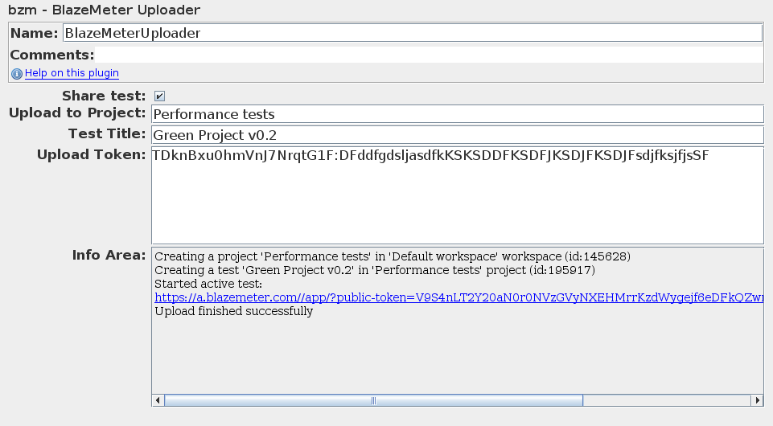

# BlazeMeter Uploader

This is special plugin for uploading results to
[BlazeMeter](https://a.blazemeter.com/)
during the test running.

## Fields

_Anonymous test_ will enable result feeding to service without any other settings required. You will receive the link for your report in the Info Area, and the link will be automatically opened in your system browser. Anonymous reports are kept for 7 days.

_Share test_ if is enabled, anyone with the link can access the report.

_Project Workspace_ field specifies workspace name or Id in which you will upload results.

_Upload to Project_ field specifies project name or Id in which you will upload results.

_Test Title_ may be used to customize test title displayed on report pages.

You need to receive special string token at [a.blazemeter.com](https://a.blazemeter.com/)
to use as your upload identifier with this plugin. You can find it under your [Settings => API Keys](https://a.blazemeter.com/app/#/settings/api-keys).
Please, treat the token as confidential, everyone who knows it
may upload files to your projects. Join key ID and secret with single colon: `TDknBxu0hmVnJ7NrqtG1F:DFddfgdsljasdfkKSKSDDFKSDFJKSDJFKSDJFsdjfksjfjsSF`

# Usage

  1. Go to a.blazemeter.com and [issue an upload token](https://a.blazemeter.com/app/#/settings/api-keys)
  2. Copy & paste it into _Upload Token_ field of BlazeMeter Uploader
  3. Run your test, verify in _Info Area_ that results uploaded successfully
  4. Analyze performance report and organize your tests at a.blazemeter.com

Please copy the token carefully, don't miss any chars or add extra.

Make note that BlazeMeter has limits for uploaded tests, projects, workspaces, which differs according to your plan.

