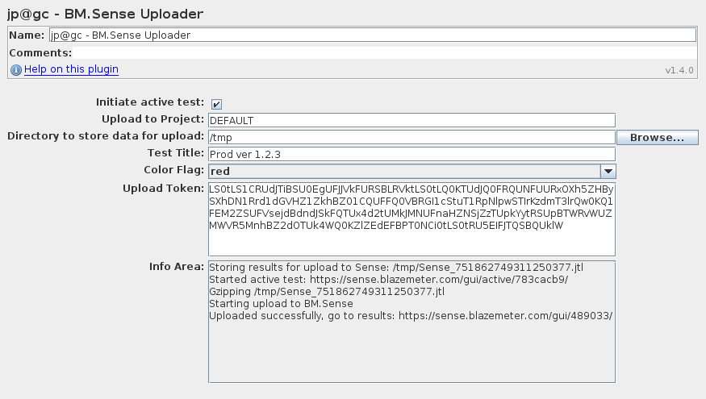

# BM.Sense Uploader

This is special plugin for uploading results to
[BlazeMeter Sense](https://sense.blazemeter.com/?utm_source=jpgc&utm_medium=link&utm_campaign=wiki)
immediately after test end. It was previously known as "Loadosophia Uploader" and has changed the name following service rename.

## Fields

You need to receive special string token at sense.blazemeter.com
to use as your upload identifier with this plugin. 
Please, treat the token as confidential, everyone who knows it
may upload files to your projects. 

_Upload to Project_ field specifies project name in which you will upload results.

_Test Title_ may be used to customize test title displayed on report pages.

_Color Flag_ sets test to have color mark in BlazeMeter Sense interface.

# Usage

  1. Go to sense.blazemeter.com and [issue an upload token](https://sense.blazemeter.com/gui/settings/?utm_source=jpgc&utm_medium=link&utm_campaign=wikitoken)
  2. Copy & paste it into _Upload Token_ field of BM.Sense Uploader
  3. Run your test, verify in _Info Area_ that results uploaded successfully
  4. Wait for uploaded file to be processed at [uploads page](https://sense.blazemeter.com/gui/upload/?utm_source=jpgc&utm_medium=link&utm_campaign=wikiupload)
  5. Analyze performance report and organize your tests at [BlazeMeter Sense](https://sense.blazemeter.com)

Please copy the token carefully, don't miss any chars or add extra.

Make note that BlazeMeter Sense has limits for uploaded file size, which differs according to your plan.

If you get "Cannot send empty" log messages or uploaded files seems to be incomplete, consider setting `jmeter.save.saveservice.autoflush=true` in `jmeter.properties` file.

