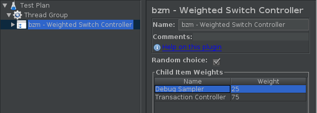

# Weighted Switch Controller

This controller takes the information about child elements and offers managing relative weights for them. Relative weight means how frequently the child element will be executed during thread iterations. Please note that each thread has independent counter of iterations. 

Relative weights mapped to child names and it save values even if the order of the child has changed. In the case of adding a new child or rename existing child will be set the default value of the relative weight for this child. If the child element is disabled, the relative weight of this element will not be counted in the test.

* `Random Choice` -  on each iteration plugin will choose a random item. This check box can not guarantee that actual percent of child elements execution will equals with expected (delta in tests not more than 0.5%)

